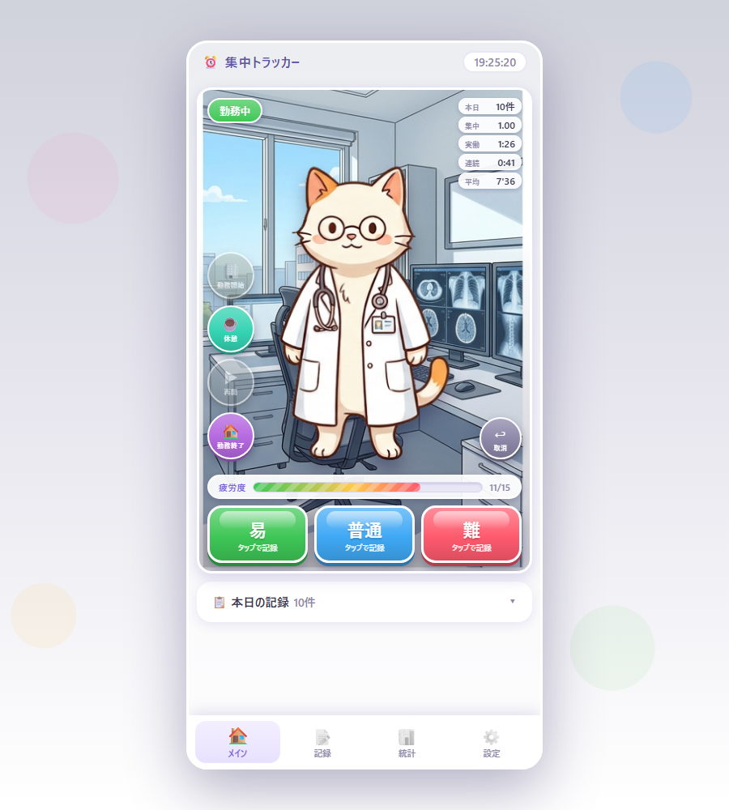

# 集中トラッカー(focus-tracker)

作業1件ごとの難易度をワンタップで記録し、休憩アラートと集中力の統計を提供するシングルユーザー向けWebアプリです。キャラクターが常駐するステージ画面で、時間帯によって背景が変わります。



- **ローカル完結**: データはすべて自分のPCの中(`data/focus.db` 1ファイル)。クラウドへの送信はありません
- **依存ゼロ**: Node.js だけで動きます(外部パッケージなし・ビルド不要)
- **スマホ対応**: Tailscale を使えばスマホからも同じ画面が使えます(オプション。PCだけでも全機能動作)
- 睡眠記録・深夜0時をまたぐ勤務・日/週/月/年の統計・ダークモードに対応

## 必要環境

- Node.js **22.13 以上**(24 推奨)。外部パッケージは使っていないため、これだけで動きます。
  - DBはNode組み込みの `node:sqlite` を使用(SQLiteファイル1個で完結、バックアップはファイルコピーでOK)
- **Node.jsを入れたくない場合**: [Releases](../../releases) の **Node同梱zip**(`-win-x64.zip`)をダウンロードすれば、**解凍して Start.bat をダブルクリックするだけ**で動きます(インストール不要。`runtime\` フォルダに Node.js 実行ファイルを同梱しています)

## 入手方法

**かんたんな方法** — ソフトの追加は不要です。

1. このページの**右上にある緑色の「Code」ボタン**を押します
2. メニューのいちばん下の **「Download ZIP」** を押します
3. ダウンロードした ZIP を展開し、できたフォルダをPCの好きな場所に置きます
   (フォルダ名は何でも構いません。後から移動しても大丈夫です)

**git を使う方法** — 更新を受け取りやすくなります。

```bash
git clone https://github.com/m-higashi/focus-tracker.git
```

更新するときはフォルダの中で `git pull` するだけです。記録したデータ(`data/` の中)は
更新の対象外なので消えません。

> **Node.js を入れたくない場合**は [Releases](../../releases) の **Node同梱zip**(`-win-x64.zip`)を
> どうぞ。解凍して `Start.bat` をダブルクリックするだけで動きます(Windows 版のみ)。

## セットアップと起動

### Windows

**`Start.bat` をダブルクリックするだけです**(コンソール1本で起動し、閉じると停止)。

### macOS / Linux

**`Start.command` をダブルクリック**します(ターミナルが開いて起動し、ウィンドウを閉じると停止)。
**実機(macOS 26.5.1 / Apple Silicon)で動作を確認済み**です。

#### 1. Node.js を入れる(初回だけ)

**22.13 以上**が必要です。まず確認してください。

```bash
node -v
```

`v22.13` 以上と出ればそのまま使えます。無い・古い場合はどちらかで入れてください。**どちらでも動作は同じです。**

| 入れかた | 補足 |
|---|---|
| [nodejs.org](https://nodejs.org/) の「**LTS**」版インストーラ | 設定は変えず進めるだけ。⚠️途中で**管理者パスワード**を求められます |
| `brew install node` | すでに Homebrew をお使いなら。**管理者パスワードは不要** |

> Node同梱zip は Windows 版(`-win-x64.zip`)のみです。macOS では Node.js のインストールが必要です。

#### 2. 初回起動時の「ブロックされました」

作者の署名(Apple への有料登録)が無いため、**初回だけ**許可の操作が要ります。
**macOS のバージョンで場所が違います。**

| バージョン | 操作 |
|---|---|
| **macOS 15 (Sequoia) 以降** | システム設定 → **プライバシーとセキュリティ** → **セキュリティ欄**(FileVault の少し上あたり)の「お使いのMacを保護するために "Start.command" がブロックされました」の右の **「このまま開く」** → 許可後にもう一度ダブルクリック |
| macOS 14 (Sonoma) 以前 | `Start.command` を右クリック(control+クリック)→ **「開く」** → 確認画面でもう一度「開く」 |
| どちらも面倒なとき | ターミナルで `sh ` と打ち、半角スペースの後に `Start.command` をドラッグ&ドロップして Enter |

一度許可すれば、次からはダブルクリックで起動します。
⚠️**画面には何も出ず、通知だけのことがあります。**「押しても何も起きない」ときは、まずここを疑ってください。

#### 3. 実行権限について

**通常は何もいりません。** ZIP・`git clone` のどちらで入れても実行権限は付いています。
「アクセス権がありません」と出たときだけ、次を実行してください。

```bash
chmod +x Start.command backup.command
```

#### 4. Mac起動時に自動で立ち上げる(任意)

「システム設定」→「一般」→「ログイン項目」で `Start.command` を追加します。
やめるときは同じ画面で「−」を押すだけです(Windows の `RegisterAutostart.cmd` に相当します)。

#### 5. Windows のファイルとの対応

| Windows | macOS / Linux |
|---|---|
| `Start.bat` | `Start.command` |
| `backup.cmd` | `backup.command` |
| `Setup.bat` | ありません(Node.js をご自分で入れます) |
| `RegisterAutostart.cmd` / `UnregisterAutostart.cmd` | ありません(ログイン項目で登録・解除) |
| `data\focus.db` | `data/focus.db` |

**フォルダごとコピーすれば Windows ⇄ Mac の行き来もできます**(記録データの中身は共通です)。
スマホから使うアドレス(`100.x.x.x`)は端末ごとに変わるので、移したあとは起動時の表示で確認してください。

### 開発・手動起動(共通)

```
npm install   （依存ゼロなので一瞬で終わります）
npm start
```

起動すると `http://localhost:3000` で使えます。

バインド先は自動で決まります:

- **Tailscale が動いている場合**: Tailscale IP(100.x.x.x)と localhost のみで待ち受けます。Tailscaleネットワーク内の端末と自分のPCからだけアクセスでき、社内LANには公開されません
- **Tailscale IP が見つからない場合**: `0.0.0.0`(全インターフェース)で待ち受けます
- 手動で固定したい場合: 環境変数 `HOST` を設定
  - Windows: `set HOST=0.0.0.0 && npm start`
  - macOS/Linux: `HOST=0.0.0.0 npm start`
- ポートを変えたい場合: 環境変数 `PORT` を設定(例: macOS/Linux は `PORT=8080 npm start`)

起動時のコンソールに、実際に待ち受けているURLが表示されます。

## 他端末(スマホ等)からのアクセス

### Tailscale IP で直接アクセス(いちばん簡単)

サーバーPCの Tailscale IP(例: `100.x.y.z`)を使い、スマホのブラウザで

```
http://100.x.y.z:3000
```

### tailscale serve で HTTPS 化する場合

HTTPSで配信したい場合は tailscale serve が使えます(必須ではありません。アプリはHTTPのままでも全機能動きます)。

```
tailscale serve --bg 3000
```

これで `https://<マシン名>.<tailnet名>.ts.net/` からアクセスできます。確認は `tailscale serve status`、解除は `tailscale serve --bg off`。

## サインイン時の自動起動

### macOS の場合

「システム設定」→「一般」→「ログイン項目」→ 左下の「+」で `Start.command` を追加します。
解除は同じ画面で「−」を押すだけです。

### Windows の場合

#### 方法0: RegisterAutostart.cmd(いちばん簡単・推奨)

同梱の `RegisterAutostart.cmd` をダブルクリックするだけで、サインイン時に自動起動するようになります(スタートアップフォルダにショートカットを作る方式。管理者権限不要)。解除は `UnregisterAutostart.cmd`。

#### 方法1: タスクスケジューラ(追加ソフト不要)

1. タスクスケジューラを開く → 「基本タスクの作成」
2. 名前: `集中トラッカー` など
3. トリガー: **ログオン時**(または「スタートアップ時」)
4. 操作: **プログラムの開始**
   - プログラム: `C:\Program Files\nodejs\node.exe`(`where node` で確認)
   - 引数: `server.js`
   - 開始(作業フォルダ): このフォルダのフルパス(例: `C:\Users\<ユーザー名>\Desktop\集中力管理`)
5. 作成後、タスクのプロパティ → 「ユーザーがログオンしているかどうかにかかわらず実行する」にすると常時起動になります

#### 方法2: pm2 を使う場合

```
npm install -g pm2
pm2 start server.js --name focus-app
pm2 save
```

(Windowsでpm2を自動起動させるには `pm2-installer` 等が別途必要です。タスクスケジューラの方が手軽です)

## キャラクター画像の差し替え

`assets/character/` 以下の画像を差し替えるだけで反映されます(サーバー再起動不要、ブラウザ再読み込みで反映)。

### 命名規則

状態ごとに以下の名前のファイルを置きます(png / webp / jpg / gif / svg 対応):

| 状態 | ファイル名 | 表示されるタイミング |
|---|---|---|
| 通常 | `idle.png` | 作業中 |
| 喜び | `happy.png` | 記録した瞬間(数秒表示) |
| ストレッチ | `stretch.png` | 休憩アラート時 |
| 休憩 | `rest.png` | 休憩中 |

- **バリエーション**: `happy_01.png`, `happy_02.png` のように `_` 区切りで複数置くとランダムに選ばれます
- **キャラクターセット**: `assets/character/` の下にフォルダを作る(例: `cat/`, `mychar/`)と1フォルダ=1セットになり、設定画面の「キャラクターセット」で切り替えられます。`assets/character/` 直下に直接置いた場合は `default` セットになります
- **日替わりランダム**: 設定で「🎲 日替わりランダム」を選ぶと、日付ごとにランダムなセットが選ばれます(同じ日はどの端末でも同じキャラ)
- 初期状態では、白衣の動物キャラクター5種(`cat` / `dog` / `bird` / `frog` / `rabbit`)が入っています
- 画像が1枚もない場合は絵文字のプレースホルダーが自動表示されます

## バックアップと引越し

- データはすべて `data/focus.db`(SQLite)にあります。アプリ一式は1フォルダ完結・相対パスのみなので、**フォルダごとコピーすればバックアップ=引越しが完了**します(WindowsとmacOSの間で移しても、そのまま使えます)
- **毎日、その日最初の「勤務開始」で自動バックアップ**されます(`backups/` に日時付きで保存、直近30個を保持)。手動は設定タブ「💾 バックアップ作成」、復元も設定タブからUIで行えます(「🩺 データを点検」で整合性確認も可能)
- `backup.cmd` はダブルクリック用の代替手段です

## セキュリティ

脅威モデル: Tailscale VPN内・単独ユーザー。認証は置かず、以下で防御しています。

- **Host検証**: ローカルインターフェースのIP・ホスト名・`*.ts.net` 以外のHostヘッダは403(DNSリバインディング対策)
- **クロスサイトPOST遮断**: 外部OriginやSec-Fetch-Site: cross-siteの更新系リクエストは403
- **パス検証**: `public/`・`assets/` の外へのアクセスは403(トラバーサル対策、実測テスト済み)

## 主な機能と使い方

- **メイン**: 「勤務開始」を押してから、作業が1件終わるたびに難易度ボタンをタップ。所要時間は自動計算(前件の終了時刻/勤務開始/休憩終了からの経過)。誤タップは「↩ 取消」
- **休憩・睡眠**: 昼休みは「勤務終了→勤務開始」、短い休憩は「休憩→再開」。勤務外は同じボタンが「就寝/起床」に変わり、睡眠時間も記録できます(就寝アラートつき)
- **深夜0時をまたぐ勤務もOK**: 勤務終了を押すまでは前日の勤務の続きとして正しく集計されます
- **アラート**: 連続作業が設定分数(既定50分)を超えるか、疲労度スコア(難易度ごとの係数+連続10分ごと+1)がしきい値を超えると、バナー+キャラクターで休憩を促します。スヌーズ可
- **記録タブ**: 過去日を含めて、作業記録と勤務・休憩・睡眠イベントを1本の時系列リストで確認・追加・修正・削除(押し忘れの修正はここで。所要時間は自動で再計算)
- **統計タブ(日/週/月/年)**: 集中度指数(難易度ごとの自分の中央値÷実所要時間、1.0が普段どおり)の推移、日別件数、連続作業時間と集中度、勤務ごとの休憩回数と集中度、時間帯×曜日ヒートマップ、睡眠と集中度の関係、CSVエクスポート
- **設定タブ**: 難易度の段階・ラベル・疲労度係数、アラートしきい値、キャラクターセット、バックアップ・復元など(全項目、変更した瞬間に自動保存)

## 構成

```
server.js          HTTPサーバー+API(Node標準モジュールのみ)
src/db.js          SQLite初期化(data/focus.db。初回起動時に自動作成)
src/logic.js       所要時間計算・疲労度・統計ロジック
public/            フロントエンド(素のHTML/CSS/JS、ビルド不要)
assets/character/  キャラクター画像(白衣の動物5種)
assets/bg/         ステージ背景画像(時間帯4種×平日/休日+イベント用。時間帯で自動切替)
data/focus.db      データ本体(SQLite。初回起動時に作られます)
Start.bat          起動(Windows)
Start.command      起動(macOS / Linux)
backup.cmd         バックアップスクリプト(Windows)
backup.command     バックアップスクリプト(macOS / Linux)
説明書.md / .txt   詳しい使い方ガイド
```

## 画像について(生成AI使用の明記)

同梱のキャラクター画像・背景画像は、生成AI(Google Gemini)でテキストプロンプトから作成したものです(参照画像は使用していません)。画像には Google の電子透かし(SynthID)が含まれる場合があります。AI生成画像の性質上、これらの画像には著作権保護が及ばない可能性があります。自作イラストへの差し替えは `assets/` の画像を置き換えるだけでできます(上記「キャラクター画像の差し替え」参照)。

## ライセンス

[MIT License](LICENSE) — コードは自由に利用・改変・再配布できます。

このアプリのコードは [Claude Code](https://claude.com/claude-code)(Anthropic)を使って開発されました。
